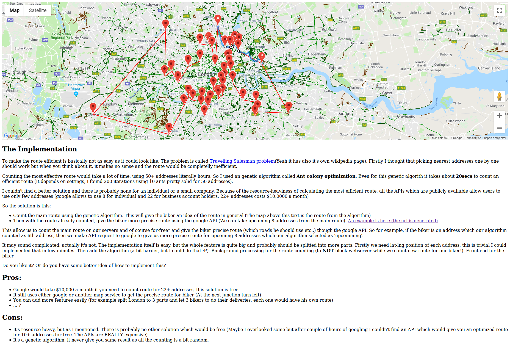

# Warning

I have done this in late 2013 or early 2014 (I Think). Most of the assumptions are probably invalid today.

It has been built on Ruby 2.4.0 so please use this version when trying to run the app

# Implementation

My implementation uses a genetic algorithm called Ant Colony Optimization. The description is inside the app I created, here's a screenshot.



# How to run

Database preparing

```
rake db:migrate db:seed
```

This will seed the database with locations of about 50 addresses of customers

run the app with

```
rails s
```

and navigate your browser to

```
http://localhost:3000/map
```
